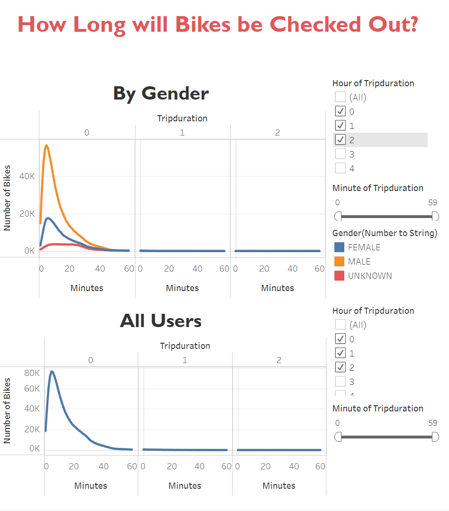
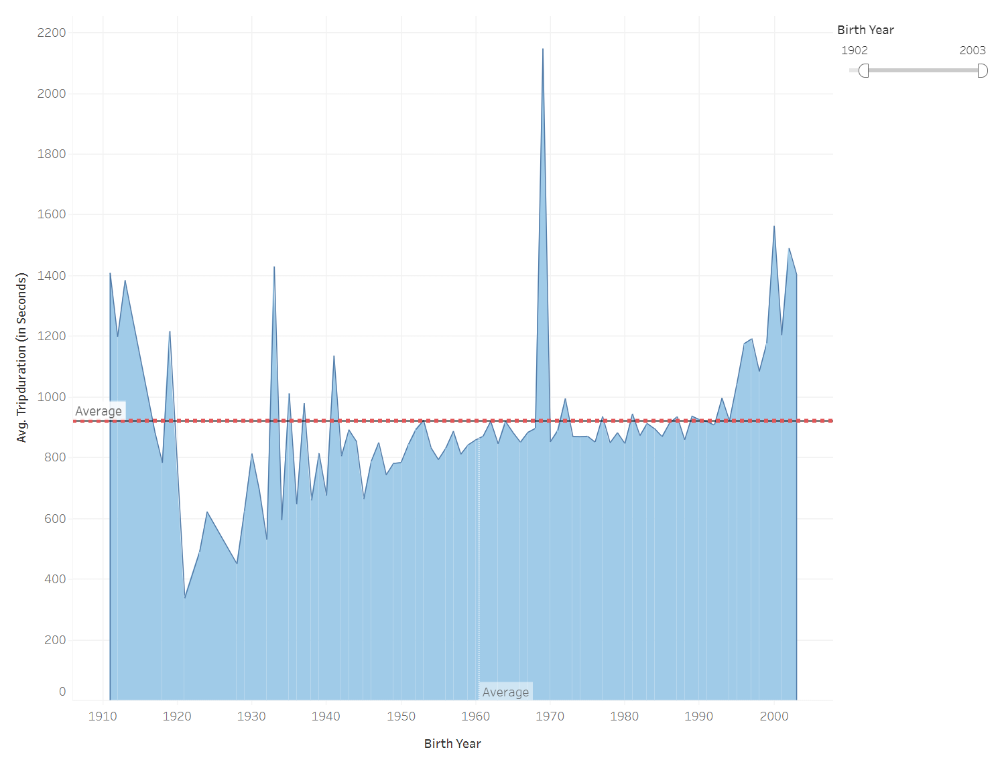
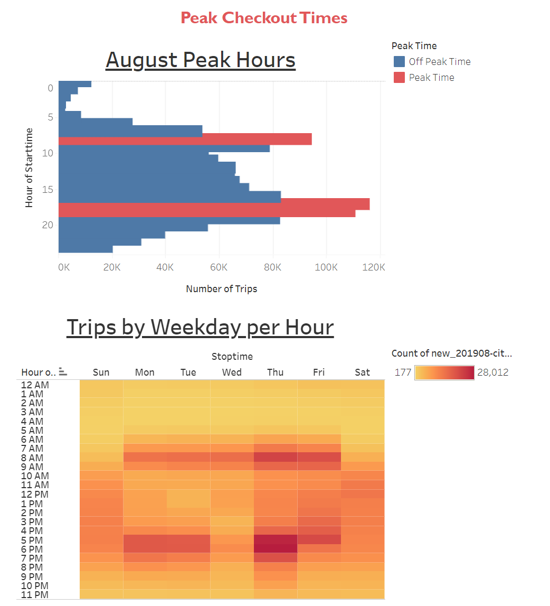
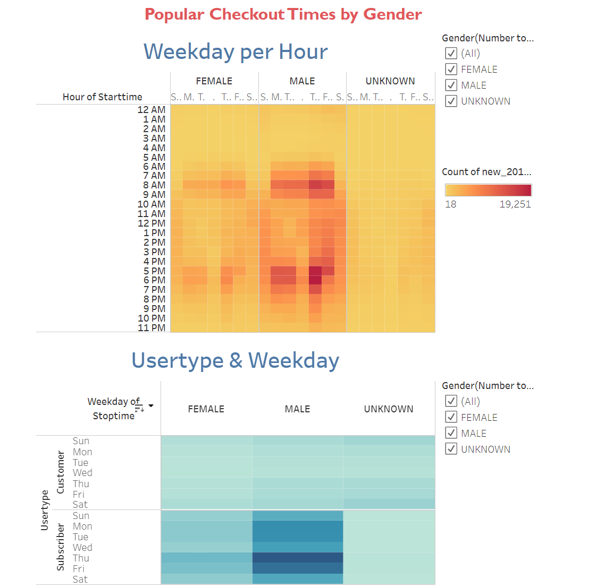

# Bikesharing

## Overview of Project
### Purpose of Project
In this project, I demonstrated my proficiency with various Tableu features to create dynamic data visualizations using worksheets, dashboards, and stories to show the length of time that bikes are checked out for all riders and genders, the number of bike trips for all riders and genders for each hour of each day of the week, and the number of bike trips for each type of user and gender for each day of the week.

### Background of Project
After a trip to New York City, Kate and I decide we want to start a similar bike-share business in our hometown of Des Moines, IA. This Tableu report uses the August 2019 Citibike data to show a potential angel investor how the bike-share program works in New York City so we can understand how a similar program will work in Des Moines.  

---
## Results
Interact with all visualizations using this [link to dashboard](https://public.tableau.com/shared/2D388S5TG?:display_count=n&:origin=viz_share_link).

### Slide 1
This slide allows users to compare how long riders checkout bikes by gender. The data shows that males checkout more citibikes than other genders; however, all genders show similar trends with the highest checkout duration between 5 minutes and 10 minutes. 
* Males : 5 min
* Females: 6 min
* Unknown: 10 min 

### Slide 2
This slide allows users to compare how long riders checkout bikes by age. Although there is a spike in the year 1969, the data shows a slight increase in trip duration for younger riders born after 1989.  

### Slide 3
This slide allows users to identify peak checkout times by time of day and day of the week. The data suggests that citibikes are a popular choice for commuters:
* Peak Hours 8am, 5pm, and 6pm
* Monday-Friday, users typically checkout citibikes 7AM-7PM.
* On Weekends, users typically checkout citibikes 10AM-6PM. 

### Slide 4
This slide allows users to compare peak days of the week against gender, time, and customer verses subscriber. The second visualization shows weekends are more popular for one-time customers while weekdays are more popular for subscribers. 

---
## Summary
These visualizations of the New York City August 2019 create a picture of the typical rider as a male subscriber who primarily uses citibike to commute to work. One-time customers typically checkout citibikes on weekends between 10AM and 6PM. The majority of riders checkout bikes for 5-10 minutes and rarely checkout bikes longer than 40 minutes. 

This dashboard is a snapshot of August. To understand how a similar program will work in Des Moines, I would want to expand the data to a full calendar year. Then two additional visualizations are suggested for future analysis: 
* Bar chart to compare of the number of bikes checkout by month. 
* Box-and-Whisker plots of the number of bikes checkout for each month. 

